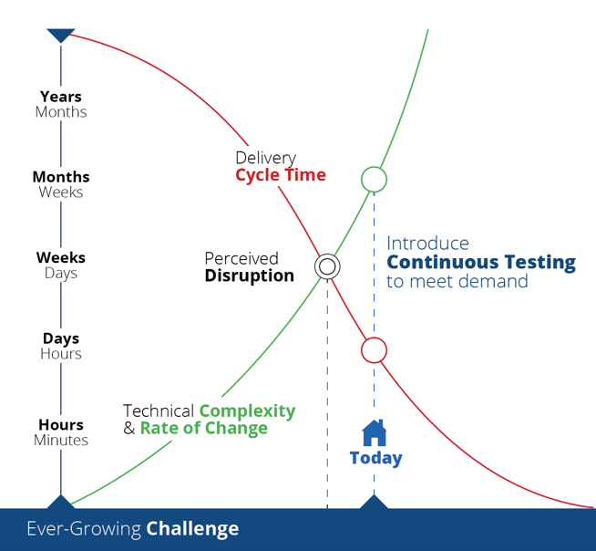
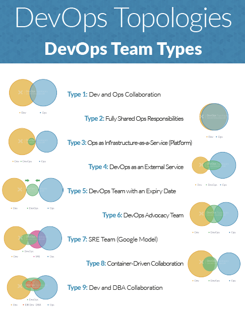

# Home Page

This guide contains all the useful links to various resources to help grow knowledge regards to all Dev-ops related stuff.

## DevOps is a set of practices that emphasize the collaboration and communication of both Software Engineers and IT & Infrastructure Operations to reduce the time to market of a Product.

DevOps is a process that emphasizes communication and learning from a technical standpoint between software developers and IT professionals, like dev and ops, managing production environments, while automating the deployment of software and infrastructure changes with utmost care and collaboration. At the core, DevOps means combining development and operations into one unified team so that continuous process of learning, knowledge sharing, and shared responsibilities happen seamlessly between the two. The idea of DevOps grew out of the Agile methodology and first gained attention in 2009.









[https://xebialabs.com/assets/files/whitepapers/IT-Managers-Guide-to-DevOps.pdf](https://xebialabs.com/assets/files/whitepapers/IT-Managers-Guide-to-DevOps.pdf)

[https://stackify.com/top-devops-tools/](https://stackify.com/top-devops-tools/)

[https://xebialabs.com/assets/files/infographics/periodic-table-of-devops-tools-v3.pdf](https://xebialabs.com/assets/files/infographics/periodic-table-of-devops-tools-v3.pdf)















1. DevOps is not an individual role, it is a group effort.
2. Your infra should be able to handle a failed deployment automatically and rollback. If it can’t, you’re doing it wrong.
3. DevOps means different things to different people.
4. If any task cannot be automated, remove it instantly from the task list.
5. Communication is more important than tooling and will make or break an organization.
6. Shift the focus of Security to the left in the development life-cycle.
7. Using Jenkins != CI/CD or DevOps …
8. Always design with autoscaling in mind. Automate-all-the-things. One-click deploy to one-click revert.
9. Create ready to use images in AWS and use those images for auto-scaling instead of scripted from GitHub builds.
10. There is a real skillset shortage in the DevOps field.
11. The CI/CD pipeline is one of the best practices for DevOps teams to implement, for delivering code changes more frequently and reliably.
12. Do not automate a bad process, you end up with an automated bad process — \[Credits: DOES18 \]
13. Testers who know how to code and automate scripts to test various cases are in massive demand in DevOps.
14. Add monitoring to infrastructure as well as applications. The monitoring system should send alerts on every important events.
15. Utilize Infrastructure as a code templates to build the infra. Ex. cloud-formation, terraform etc
16. If you need to SSH into your VM then your automation is failed.
17. Serverless is not actually serverless, it is simply 'pay as you use' model
18. Cloud-native is not a synonym for microservices or Kubernetes, it is all about utilizing the advantages of the cloud computing model

