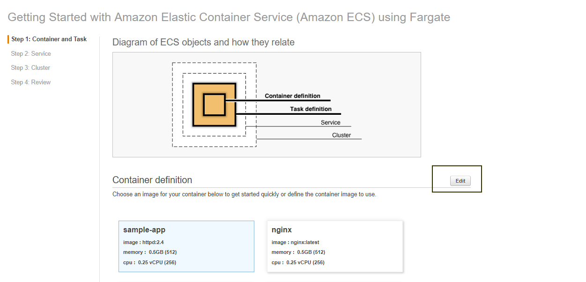

# ECS Fargate

AWS Fargate :Run containers without managing servers or clusters

 AWS Fargate is a compute engine for Amazon ECS that allows you to run [containers](http://aws.amazon.com/what-are-containers) without having to manage servers or clusters. With AWS Fargate, you no longer have to provision, configure, and scale clusters of virtual machines to run containers. This removes the need to choose server types, decide when to scale your clusters, or optimize cluster packing. AWS Fargate removes the need for you to interact with or think about servers or clusters. Fargate lets you focus on designing and building your applications instead of managing the infrastructure that runs them.

That's just the copy pasted paragraph from AWS's article but that give's a bird's eye view of the whole thing :\)

Lets get our hands dirty :

Go to the Get started page and click edit on the container definition section.

1. Give the container a name
2. Give the image name. My AWSapi image on dockerhub in this case
3. Give the port no's which are being exposed/used by the container

If you click the Advanced configuration option than many more option's like healthcheck/environment's appear.

I am avoiding them and click update.

You should be able to see your container highlighted here. Confirm the image/cpu settings before moving ahead. We will be changing that in the next step.

Click edit on the task definition. **Task Definition is like the blueprint of the application.**

1. Give the task a name
2. Your default network mode is awsvpc // thats the docker networking mode
3. Role given to ECS to pull private images etc
4. Launch type is  FARGATE
5. This is the Memory allocated to single task.. you can change it according to your container needs
6. Same thing applies to CPU specifications.

I choose the default ones and move ahead.

Next is the service definition.. Service is basically the instance of the task definition. Click 'Edit'

1. Give the service a name
2. Give the number of task's you want running in a service. I am selecting 2.
3. Give the security group details here.
4. Select the load balancer type or none.
5. Select the port no for the Load balancer

Next give the Cluster configuration. Iam choosing the default ones.

Final section is the review section.

Click Create.

This status page will open showing the progress in preparing the service.

If all goes well, You should be able to see everything green :\) Click 'View Service'

Three things to notice on the main page here:

1. The status is ACTIVE
2. The Running tasks count is  0
3. Loadbalancer is active too.

 

Tasks are in pending state

Meanwhile on Cloudformation console you can see the stack created

My containers kept failing for the above reason.

Temporarily deleted the cluster 

Went to task definition's and created new revision. Made some tweaks to the memory section.

and voila:

That was another quick overview of Fargate side of ECS just like the EC2 side of it. But in this case we donot have to care about the cluster management as AWS will take care of it. SERVERLESS CONTAINER's you'll !! :\)

1. 

